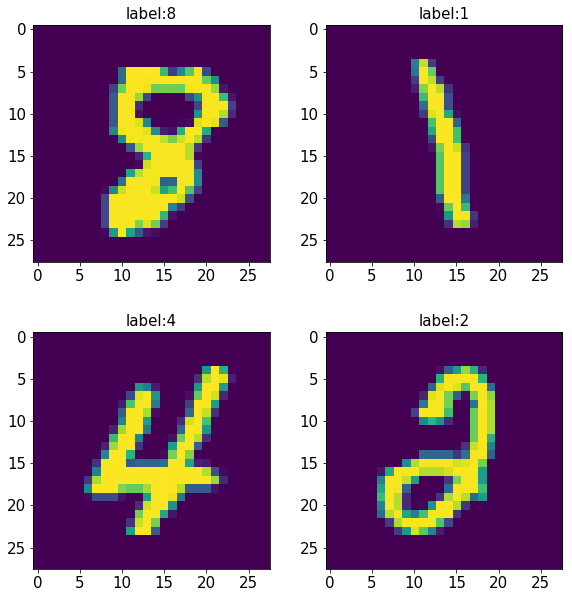

# 《Python深度学习》学习笔记

日期：2019/07/09
作者：xiaoli
字数：10k

## 前言

这是我在学习《Python深度学习》中的笔记，这本书的原书是《Deep Learning with Python》，是一本十分通俗易懂的书，因此有必要进行深入的学习。

## 目录

[TOC]

## 第1章 什么是深度学习

> 对于未来或当前的机器学习从业者来说，重要的是能够从噪声中识别出信号，从而在过度炒作的新闻稿中发现改变世界的重大进展。

人工智能、机器学习与深度学习的关系那张图十分重要，见P2。

> 图灵的这个问题引出了一种新的编程范式。在经典的程序设计（即符号主义人工智能的范式）中，人们输入的是规则（即程序）和需要根据这些规则进行处理的数据，系统输出的是答案（见图 1-2）。利用机器学习，人们输入的是数据和从这些数据中预期得到的答案，系统输出的是规则。这些规则随后可应用于新的数据，并使计算机自主生成答案。

上面那段话也很重要

你可以将深度网络看作多级信息蒸馏操作：信息穿过连续的过滤器，其纯度越来越高（即对任务的帮助越来越大）。

人们曾对人工智能极度乐观，随后是失望与怀疑，进而导致资金匮乏。这种循环发生过两次。

> 当前工业界所使用的绝大部分机器学习算法都不是深度学习算法。深度学习不一定总是解决问题的正确工具：有时没有足够的数据，深度学习不适用；有时用其他算法可以更好地解决问题。如果你第一次接触的机器学习就是深度学习，那你可能会发现手中握着一把深度学习“锤子”，而所有机器学习问题看起来都像是“钉子

> 深度学习还让解决问题变得更加简单，因为它将特征工程完全自动化，而这曾经是机器学习工作流程中最关键的一步。

如何了解机器学习算法和工具的现状：
> 要想了解机器学习算法和工具的现状，一个好方法是看一下 Kaggle 上的机器学习竞赛。

>就数据而言，除了过去 20 年里存储硬件的指数级增长（遵循摩尔定律），最大的变革来自于互联网的兴起，它使得收集与分发用于机器学习的超大型数据集变得可行

## 第2章 神经网络的数学基础

### 2.1 初识神经网络

这里进行了第一个小demo，是基于Keras的手写数字分类。

这里使用到的数据集是MNIST数据集。

在调试书上给出的代码前，先熟悉以下基本的库和工具

#### 2.1.1 Mnist数据集

首先是使用Ipython来导入Mnist库并查看其相应的功能：

```python
# 输入
from keras.datasets import mnist
print(help(mnist))
```

```python
# 输出
'''
Help on module keras.datasets.mnist in keras.datasets:

NAME
    keras.datasets.mnist - MNIST handwritten digits dataset.

FUNCTIONS
    load_data(path='mnist.npz')
        Loads the MNIST dataset.
        
        # Arguments
            path: path where to cache the dataset locally
                (relative to ~/.keras/datasets).
        
        # Returns
            Tuple of Numpy arrays: `(x_train, y_train), (x_test, y_test)`.

DATA
    absolute_import = _Feature((2, 5, 0, 'alpha', 1), (3, 0, 0, 'alpha', 0...
    division = _Feature((2, 2, 0, 'alpha', 2), (3, 0, 0, 'alpha', 0), 8192...
    print_function = _Feature((2, 6, 0, 'alpha', 2), (3, 0, 0, 'alpha', 0)...

FILE
    d:\anaconda3\lib\site-packages\keras\datasets\mnist.py
```

从上边可以看到Mnist库是keras中内部集成了的手写数字的数据库，而直接按照格式调用后发现数据的格式为：

```python
(train_images, train_labels), (test_images, test_labels) = mnist.load_data()
print(train_images.shape)
print(train_labels.shape)
print(test_images.shape)
print(test_labels.shape)
```

```python
# 输出
'''
(60000, 28, 28)
(60000,)
(10000, 28, 28)
(10000,)
```

可以发现，对于训练集，训练的图片是一个三维的数据立方，是由6万张图片构成，每个图片是28*28的像素格式。而训练集的标签为一维的向量，即6万个类别，其中覆盖0到9。而测试集的数据也是对应的，只不过总共有1万张照片。

以下将训练集中的四副图及其标签画出来，结果如下所示：

```python
import matplotlib.pyplot as plt
import numpy as np

# 载入数据集，并且输出维度大小
(train_images, train_labels), (test_images, test_labels) = mnist.load_data()

# 随机提取四副图片
index = np.random.randint(0, 60000, 4)

# 绘制四副图片
plt.figure(figsize=(10, 10))                         # 设置图片画布大小
plt.subplots_adjust(wspace = 0.1, hspace = 0.3)      # 设置子图间隔大小
for i in range(4):
    plt.subplot(2,2,i+1)
    title = 'label:'+str(train_labels[index[i]])     # 中间的+号表示字符串拼接，真是神奇啊
    plt.title(title, fontsize = 15)                  # 设置图片标题以及字体大小
    plt.xticks(fontsize = 15)                        # 设置x刻度大小
    plt.yticks(fontsize = 15)                        # 设置y刻度大小
    plt.imshow(train_images[index[i],:,:]) 
plt.show()
```



可以看到训练集中的图像和标签（即图像的标题）是一致的

#### 2.1.2 原始手写数字识别代码

书上给的源代码，仅给出运行结果为：

```python
# 2-1-Mnist.py
from keras.datasets import mnist       
from keras.utils import to_categorical 
from keras import models			  
from keras import layers             

(train_images, train_labels), (test_images, test_labels) = mnist.load_data()

network = models.Sequential()
network.add(layers.Dense(512, activation='relu', input_shape=(28 * 28,)))
network.add(layers.Dense(10, activation='softmax'))

network.compile(optimizer='rmsprop',
 				loss='categorical_crossentropy',
 				metrics=['accuracy'])

train_images = train_images.reshape((60000, 28 * 28))
train_images = train_images.astype('float32') / 255
test_images  = test_images.reshape((10000, 28 * 28))
test_images  = test_images.astype('float32') / 255

train_labels = to_categorical(train_labels)
test_labels  = to_categorical(test_labels)

network.fit(train_images, train_labels, epochs=5, batch_size=128)

test_loss, test_acc = network.evaluate(test_images, test_labels)
print('test_acc:', test_acc)
```

```python
Epoch 1/5
60000/60000 [===========================] - 60s 1ms/step - loss: 0.2579 - acc: 0.9258
Epoch 2/5
60000/60000 [===========================] - 61s 1ms/step - loss: 0.1038 - acc: 0.9693
Epoch 3/5
60000/60000 [===========================] - 76s 1ms/step - loss: 0.0695 - acc: 0.9783
Epoch 4/5
60000/60000 [===========================] - 66s 1ms/step - loss: 0.0501 - acc: 0.9855
Epoch 5/5
60000/60000 [===========================] - 65s 1ms/step - loss: 0.0379 - acc: 0.9887
Test  1/1
10000/10000 [===========================] - 19s 2ms/step - test_acc: 0.9774
```

#### 2.1.3 to_categorica 函数

这里需要明白其中各个函数的意义，首先是 to_categorica 函数

```python
print(help(to_categorical))
```

```python
# 输出
'''
Help on function to_categorical in module keras.utils.np_utils:
 
to_categorical(y, num_classes=None, dtype='float32')
    Converts a class vector (integers) to binary class matrix.
    
    E.g. for use with categorical_crossentropy.
    
    # Arguments
        y: class vector to be converted into a matrix
            (integers from 0 to num_classes).
        num_classes: total number of classes.
        dtype: The data type expected by the input, as a string
            (`float32`, `float64`, `int32`...)
    
    # Returns
        A binary matrix representation of the input. The classes axis
        is placed last.

None
# Example
    # Consider an array of 5 labels out of a set of 3 classes {0, 1, 2}:
    > labels
    array([0, 2, 1, 2, 0])
    # `to_categorical` converts this into a matrix with as many
    # columns as there are classes. The number of rows
    # stays the same.
    > to_categorical(labels)
    array([[ 1.,  0.,  0.],
           [ 0.,  0.,  1.],
           [ 0.,  1.,  0.],
           [ 0.,  0.,  1.],
           [ 1.,  0.,  0.]], dtype=float32)
```

可以看到 to_categorica 函数的做账用是将一个整型向量，转换为一个二进制类的矩阵，例如将一个1*500的一维向量，但是其中只有6类，转换为一个6\*500的二维矩阵，即原来的每一类使用6位0/1的组合来进行表示。

```python
train_labels
```

```python
# 输出
'''
array([5, 0, 4, ..., 5, 6, 8], dtype=uint8)
```

```python
train_labels = to_categorical(train_labels)
train_labels
```
```python
# 输出
'''
array([[0., 0., 0., ..., 0., 0., 0.],
       [1., 0., 0., ..., 0., 0., 0.],
       [0., 0., 0., ..., 0., 0., 0.],
       ...,
       [0., 0., 0., ..., 0., 0., 0.],
       [0., 0., 0., ..., 0., 0., 0.],
       [0., 0., 0., ..., 0., 1., 0.]], dtype=float32)
```


```python
train_labels.shape
```

```python
# 输出
'''
(60000, 10)
```

可以看到在本例中，train_labels是大小为60000的一维向量，其中每个元素代表对应训练集中图片的类别，数据类型是unit8，而经过 to_categorica 函数处理后，变为60000\*10 大小的二维矩阵，这是由于原始的数据中共有0-9共10类导致，因此该函数自动统计了共有多少类别，同时每个类别使用了10组0/1的组会来进行表示。

#### 2.1.4 model模型

model是keras中的模型，常用的有两种模型，一种是Sequential 顺序模型，另外一种是[使用函数式 API 的 Model 类模型](https://keras.io/models/model)。这里可以通过以下两种方式来创建模型：

```python
from keras.models import Sequential
from keras.layers import Dense, Activation

model = Sequential([
    Dense(32, input_shape=(784,)),
    Activation('relu'),
    Dense(10),
    Activation('softmax'),
])
```

```python
model = Sequential()
model.add(Dense(32, input_dim=784))
model.add(Activation('relu'))
```

对Dense而言，input_dim和input_length是等价的。

#### 2.1.5 模型编译

模型编译其实也是配置学习过程的步骤，主要使用complie函数，关键的三个参数为：

- 优化器 optimizer
- 损失函数 loss
- 评估标准 metrics

常见范例如下：

```python
# 多分类问题
model.compile(optimizer='rmsprop',
              loss='categorical_crossentropy',
              metrics=['accuracy'])

# 二分类问题
model.compile(optimizer='rmsprop',
              loss='binary_crossentropy',
              metrics=['accuracy'])

# 均方误差回归问题
model.compile(optimizer='rmsprop',
              loss='mse')

# 自定义评估标准函数
import keras.backend as K

def mean_pred(y_true, y_pred):
    return K.mean(y_pred)

model.compile(optimizer='rmsprop',
              loss='binary_crossentropy',
              metrics=['accuracy', mean_pred])
```

#### 2.1.6 模型训练

主要使用fit函数，主要的几个参数为：

- x：训练集样本
- y：训练集标签
- epochs：整数，训练模型迭代轮次
- batch_size：整数，每次梯度更新的样本数，批大小。默认每次更新一批32个数据。

#### 2.1.7 模型评估

主要使用evaluate函数，使用测试模式，返回误差值和评估标准值。

主要是两个参数：测试集样本，以及测试集标签。

#### 2.1.8 修改版代码

以下是自己的修改版：

```python
# 载入必须的库
from keras.datasets import mnist       # 这是数据集
from keras.utils import to_categorical # 这是用于分类的工具
from keras import models               # 模型
from keras import layers               # 层
import matplotlib.pyplot as plt        # 绘图工具

# 提取原始数据，以下是固定的形式，由mnist数据集决定
(train_images, train_labels), (test_images, test_labels) = mnist.load_data()

# 数据预处理
train_images = train_images.reshape((60000, 28 * 28)) # 改为二维数组
train_images = train_images.astype('float32') / 255   # 归一化
test_images  = test_images.reshape((10000, 28 * 28))  # 改为二维数组
test_images  = test_images.astype('float32') / 255    # 归一化

# 将类向量（整数）转换为二进制类矩阵
train_labels = to_categorical(train_labels)  # 分类编码
test_labels  = to_categorical(test_labels)   # 分类编码

# 留出验证集（这里是新增加的内容）
x_val 			= train_images[:10000] # 验证集：前10000个
partial_x_train = train_images[10000:] # 训练集：10000至60000个
y_val 			= train_labels[:10000] # 验证集：前10000个
partial_y_train = train_labels[10000:] # 训练集：10000至60000个

# 建立网络模型
network = models.Sequential()  		   # 顺序模型
# 第一层：全连接层，512路relu激活函数
network.add(layers.Dense(512, activation = 'relu', input_shape = (28 * 28,)))   
# 第二层：全连接层，10路softmax激活函数
network.add(layers.Dense(10, activation = 'softmax'))							

# 配置训练模型
network.compile(optimizer = 'rmsprop',                  # 优化器，rmsprop
 				loss      = 'categorical_crossentropy', # 代价函数, 交叉熵
 				metrics   =['accuracy'])                # 评估指标，精度

# 进行网络训练
history = network.fit(partial_x_train, partial_y_train, epochs=5, batch_size=128, 						  validation_data=(x_val, y_val))   # 5轮次，每一批128个

# 查看测试集结果
test_loss, test_acc = network.evaluate(test_images, test_labels)
print('test_acc:', test_acc)

# 作图
history_dict    = history.history
loss_values     = history_dict['loss']
val_loss_values = history_dict['val_loss 
epochs = range(1, len(loss_values) + 1) # 初始化迭代轮次向量
plt.figure(1)
plt.plot(epochs, loss_values, 'bo', label='Training loss') 
plt.plot(epochs, val_loss_values, 'b', label='Validation loss') 
plt.title('Training and validation loss')
plt.xlabel('Epochs')
plt.ylabel('Loss')
plt.legend()
plt.show()

acc = history_dict['acc'] 
val_acc = history_dict['val_acc']
plt.figure(2)
plt.plot(epochs, acc, 'bo', label='Training acc')
plt.plot(epochs, val_acc, 'b', label='Validation acc')
plt.title('Training and validation accuracy')
plt.xlabel('Epochs')
plt.ylabel('Accuracy')
plt.legend()
plt.show()
```

结果如下所示：


对于上图的分析：

其中这个例子十分的简单，以至于不到30行的代码便可以完成对于几万幅图像的基于深度学习的分类识别。可以发现，训练集损失函数始终处于下降的趋势，并且训练集精度始终是逐渐提高。这就是梯度下降法的预期效果。

最终测试集精度为 97.37%，比训练集精度98.71%低一些，这是十分正常的，因为我们的神经网络只是学习了训练集的特征，还不能获得很好的泛化误差。可以从上述两幅图观察到，在第4轮迭代后验证集损失开始增大，并且验证集上的精度出现下降。**训练精度和测试精度之间的这种差距是过拟合成的**，一般来说随着神经网络在训练数据上的表现越来越好，模型最终会过拟合，在这种情况下，为了防止过拟合，可以在4轮之后停止训练。而常见的预防过拟合的方法如使用较小的网络，这需要额外的实验来进行测试。

除此之外，对于模型构建中关键参数的选择也是一个值得研究的课题，其实这也属于调参的大范围，如优化器的选择问题。有一种说法是“无论你的问题是什么，rmsprop优化器通常都是足够好的选择”，我认为不能盲从，需要从理论上分析为什么rmsprop具有广泛的适用场景。

关于这个实验还有很多值得思考的地方，需要进一步的测试和验证。


### 2.2 神经网络的数据表示

#### 2.2.1 基本概念

这里引入了一个新的概念，称之为**张量**，英文称之为**tensor**，并且谷歌的TensorFlow的含义就是流动的张量，

> tensorflow的命名来源于本身的运行原理，tensor(张量)意味着N维数组，flow（流）意味着基于数据流图的计算，所以tensorflow字面理解为张量从流图的一端流动到另一端的计算过程。

首先是关于张量的定义：

**0D张量**：也就是标量，这里为什么是0D呢，因为D的意思是Demision，即维度，而一个轴（直线）则表示一个维度，对一个标量而言，其维度是1\*1，也就是一个点，并不能构成一条直线，因此只能是0D。

**1D张量**：也就是向量，维度是1*N，注意只有一个轴，

**2D张量**：也就是二维矩阵，或者说数组，维度是M*N，注意有两个轴


注意张量的几个性质：

- 形状，即size，或者称之为shape，（3， 3， 5）
- 维度，ndim，其实就是shape的size
- 数据类型：dtype，一般都是数值类型的。


张量的三个函数：shape，ndim，dtype

实际生活中的张量

#### 2.2.2 张量切片

张量切片：这个操作很重要

#### 2.2.3 张量运算 

**张量运算：**

> 所有计算机程序最终都可以简化为二进制输入上的一些二进制运算（AND、OR、NOR 等）

深度神经网络学到的所有变换也都可以简化为数值数据张量上的一些张量运算（

rule函数背后对应的数学张量运算。

自己编写的 relu函数


**逐元素的运算**

**广播**

广播运算的自我编写

**张量点积**

对张量点积的理解，以及手写各种点积的原始的py代码

（有时间可以写一写matlab的代码）

**张量变形**


## 第三章 神经网络入门


### 3.1 神经网络基本知识

层：

dense类（密集连接层，全连接层，密集层）

循环层

二维卷积层


模型：指的是，由层构成的网络，有向无环图


损失函数：

优化器：


常见的损失函数的选择准则：

- 二分类：二元交叉熵
- 多分类：分类交叉熵
- 回归问题：均方误差
- 序列学习：联结主义时序分类


### 3.2 Keras简介

首先，Keras是一个深度学习框架。

Keras 基于宽松的 MIT 许可证发布，这意味着可以在商业项目中免费使用它。

Keras 没有选择单个张量库并将 Keras 实现与这个库绑定，而是以模块化的方式处理这个问题（见图 3-3）。因此，几个不同的后端引擎都可以无缝嵌入到 Keras 中。

目前，Keras 有三个后端实现：TensorFlow 后端、Theano 后端和微软认知工具包（CNTK，Microsoft cognitive toolkit）后端。未来 Keras 可能会扩展到支持更多的深度学习引擎。

典型的Keras开发的例子：

- 定义训练数据
- 定义由层组成的网络，或者模型
- 配置学习过程
- 进行迭代训练


两种配置模型的形式，顺序类和函数式。


如何建立深度学习工作站

- Jupyter
- 

### 3.3 电影评论分类：二分类

这里直接从这个实例开始

#### 3.3.1 首先是数据集的加载

```python
from keras.datasets import imdb
print(help(imdb))
```

```python
# 输出
'''
Help on module keras.datasets.imdb in keras.datasets:

NAME
    keras.datasets.imdb - IMDB sentiment classification dataset.

FUNCTIONS
    get_word_index(path='imdb_word_index.json')
        Retrieves the dictionary mapping words to word indices.
        
        # Arguments
            path: where to cache the data (relative to `~/.keras/dataset`).
        
        # Returns
            The word index dictionary.
    
    load_data(path='imdb.npz', num_words=None, skip_top=0, maxlen=None, seed=113, start_char=1, oov_char=2, index_from=3, **kwargs)
        Loads the IMDB dataset.
        
        # Arguments
            path: where to cache the data (relative to `~/.keras/dataset`).
            num_words: max number of words to include. Words are ranked
                by how often they occur (in the training set) and only
                the most frequent words are kept
            skip_top: skip the top N most frequently occurring words
                (which may not be informative).
            maxlen: sequences longer than this will be filtered out.
            seed: random seed for sample shuffling.
            start_char: The start of a sequence will be marked with this character.
                Set to 1 because 0 is usually the padding character.
            oov_char: words that were cut out because of the `num_words`
                or `skip_top` limit will be replaced with this character.
            index_from: index actual words with this index and higher.
        
        # Returns
            Tuple of Numpy arrays: `(x_train, y_train), (x_test, y_test)`.
        
        # Raises
            ValueError: in case `maxlen` is so low
                that no input sequence could be kept.
        
        Note that the 'out of vocabulary' character is only used for
        words that were present in the training set but are not included
        because they're not making the `num_words` cut here.
        Words that were not seen in the training set but are in the test set
        have simply been skipped.

DATA
    absolute_import = _Feature((2, 5, 0, 'alpha', 1), (3, 0, 0, 'alpha', 0...
    division = _Feature((2, 2, 0, 'alpha', 2), (3, 0, 0, 'alpha', 0), 8192...
    print_function = _Feature((2, 6, 0, 'alpha', 2), (3, 0, 0, 'alpha', 0)...

FILE
    d:\anaconda3\lib\site-packages\keras\datasets\imdb.py


None
'''
```

可以看到，这个数据集内部存在两个十分重要的函数，load_data，以及get_word_index

前者可以控制载入的数据，后者检索将单词映射到单词索引的字典。以下是导入数据并且查看大小

```python
(train_data, train_labels), (test_data, test_labels) = imdb.load_data(num_words = 10000)
print(train_data.shape)
print(train_labels.shape)
```

```python
# 输出
'''
Downloading data from https://s3.amazonaws.com/text-datasets/imdb.npz
17465344/17464789 [==============================] - 99s 6us/step
(25000,)
(25000,)
```

```python
print(train_data[0])
print(train_labels[0])
```

```python
[1, 14, 22, 16, 43, 530, 973, 1622, 1385, 65, 458, 4468, 66, 3941, 4, 173, 36, 256, 5, 25, 100, 43, 838, 112, 50, 670, 2, 9, 35, 480, 284, 5, 150, 4, 172, 112, 167, 2, 336, 385, 39, 4, 172, 4536, 1111, 17, 546, 38, 13, 447, 4, 192, 50, 16, 6, 147, 2025, 19, 14, 22, 4, 1920, 4613, 469, 4, 22, 71, 87, 12, 16, 43, 530, 38, 76, 15, 13, 1247, 4, 22, 17, 515, 17, 12, 16, 626, 18, 2, 5, 62, 386, 12, 8, 316, 8, 106, 5, 4, 2223, 5244, 16, 480, 66, 3785, 33, 4, 130, 12, 16, 38, 619, 5, 25, 124, 51, 36, 135, 48, 25, 1415, 33, 6, 22, 12, 215, 28, 77, 52, 5, 14, 407, 16, 82, 2, 8, 4, 107, 117, 5952, 15, 256, 4, 2, 7, 3766, 5, 723, 36, 71, 43, 530, 476, 26, 400, 317, 46, 7, 4, 2, 1029, 13, 104, 88, 4, 381, 15, 297, 98, 32, 2071, 56, 26, 141, 6, 194, 7486, 18, 4, 226, 22, 21, 134, 476, 26, 480, 5, 144, 30, 5535, 18, 51, 36, 28, 224, 92, 25, 104, 4, 226, 65, 16, 38, 1334, 88, 12, 16, 283, 5, 16, 4472, 113, 103, 32, 15, 16, 5345, 19, 178, 32]
1
```

可以看到总共有25000条评论，每一条评论都被分为两类（正面或者负面），并且每一条评论都不是等长的，即由若干个单词组成的句子，上面的例子即第0条评论由218个单词构成，其中每个单词由该单词在单词字典中的索引代替。

也就是说总共的数据集为一个 1\*25000 的一个一维数组（array），但是每个数组的元素是一个列表（list），而每列表对应的就是一条评论，也就是可以不等长。

```python
train_data[0:3]
```

```python
array([list([1, 14, 22, 16, 43, 530, 973, 1622, 1385, 65, 458, 4468, 66, 3941, 4, 173, 36, 256, 5, 25, 100, 43, 838, 112, 50, 670, 2, 9, 35, 480, 284, 5, 150, 4, 172, 112, 167, 2, 336, 385, 39, 4, 172, 4536, 1111, 17, 546, 38, 13, 447, 4, 192, 50, 16, 6, 147, 2025, 19, 14, 22, 4, 1920, 4613, 469, 4, 22, 71, 87, 12, 16, 43, 530, 38, 76, 15, 13, 1247, 4, 22, 17, 515, 17, 12, 16, 626, 18, 2, 5, 62, 386, 12, 8, 316, 8, 106, 5, 4, 2223, 5244, 16, 480, 66, 3785, 33, 4, 130, 12, 16, 38, 619, 5, 25, 124, 51, 36, 135, 48, 25, 1415, 33, 6, 22, 12, 215, 28, 77, 52, 5, 14, 407, 16, 82, 2, 8, 4, 107, 117, 5952, 15, 256, 4, 2, 7, 3766, 5, 723, 36, 71, 43, 530, 476, 26, 400, 317, 46, 7, 4, 2, 1029, 13, 104, 88, 4, 381, 15, 297, 98, 32, 2071, 56, 26, 141, 6, 194, 7486, 18, 4, 226, 22, 21, 134, 476, 26, 480, 5, 144, 30, 5535, 18, 51, 36, 28, 224, 92, 25, 104, 4, 226, 65, 16, 38, 1334, 88, 12, 16, 283, 5, 16, 4472, 113, 103, 32, 15, 16, 5345, 19, 178, 32]),
       list([1, 194, 1153, 194, 8255, 78, 228, 5, 6, 1463, 4369, 5012, 134, 26, 4, 715, 8, 118, 1634, 14, 394, 20, 13, 119, 954, 189, 102, 5, 207, 110, 3103, 21, 14, 69, 188, 8, 30, 23, 7, 4, 249, 126, 93, 4, 114, 9, 2300, 1523, 5, 647, 4, 116, 9, 35, 8163, 4, 229, 9, 340, 1322, 4, 118, 9, 4, 130, 4901, 19, 4, 1002, 5, 89, 29, 952, 46, 37, 4, 455, 9, 45, 43, 38, 1543, 1905, 398, 4, 1649, 26, 6853, 5, 163, 11, 3215, 2, 4, 1153, 9, 194, 775, 7, 8255, 2, 349, 2637, 148, 605, 2, 8003, 15, 123, 125, 68, 2, 6853, 15, 349, 165, 4362, 98, 5, 4, 228, 9, 43, 2, 1157, 15, 299, 120, 5, 120, 174, 11, 220, 175, 136, 50, 9, 4373, 228, 8255, 5, 2, 656, 245, 2350, 5, 4, 9837, 131, 152, 491, 18, 2, 32, 7464, 1212, 14, 9, 6, 371, 78, 22, 625, 64, 1382, 9, 8, 168, 145, 23, 4, 1690, 15, 16, 4, 1355, 5, 28, 6, 52, 154, 462, 33, 89, 78, 285, 16, 145, 95]),
       list([1, 14, 47, 8, 30, 31, 7, 4, 249, 108, 7, 4, 5974, 54, 61, 369, 13, 71, 149, 14, 22, 112, 4, 2401, 311, 12, 16, 3711, 33, 75, 43, 1829, 296, 4, 86, 320, 35, 534, 19, 263, 4821, 1301, 4, 1873, 33, 89, 78, 12, 66, 16, 4, 360, 7, 4, 58, 316, 334, 11, 4, 1716, 43, 645, 662, 8, 257, 85, 1200, 42, 1228, 2578, 83, 68, 3912, 15, 36, 165, 1539, 278, 36, 69, 2, 780, 8, 106, 14, 6905, 1338, 18, 6, 22, 12, 215, 28, 610, 40, 6, 87, 326, 23, 2300, 21, 23, 22, 12, 272, 40, 57, 31, 11, 4, 22, 47, 6, 2307, 51, 9, 170, 23, 595, 116, 595, 1352, 13, 191, 79, 638, 89, 2, 14, 9, 8, 106, 607, 624, 35, 534, 6, 227, 7, 129, 113])],
      dtype=object)
```

参数 num_words=10000 的意思是仅保留训练数据中前 10 000 个最常出现的单词。低频单词将被舍弃。这样得到的向量数据不会太大，便于处理。

```python
max([max(i) for i in train_data ]) # 先找到每一条评论中的最大值，再找所有的最大值
```

```python
9999
```

可以看到，对于train_data中最大出现的单词的索引就是9999，因此与10000个最常出现的单词是对应的。

以下是将以将某条评论迅速解码为英文单词：

```python
word_index = imdb.get_word_index() # 这一步也是要下载单词字典的
reverse_word_index = dict([(value, key) for (key, value) in word_index.items()])
decode_review = ' '.join([reverse_word_index.get(i -3, '?') for i in train_data[0]])
print(decode_review)
```

```python
# 输出
'''
? this film was just brilliant casting location scenery story direction everyone's really suited the part they played and you could just imagine being there robert ? is an amazing actor and now the same being director ? father came from the same scottish island as myself so i loved the fact there was a real connection with this film the witty remarks throughout the film were great it was just brilliant so much that i bought the film as soon as it was released for ? and would recommend it to everyone to watch and the fly fishing was amazing really cried at the end it was so sad and you know what they say if you cry at a film it must have been good and this definitely was also ? to the two little boy's that played the ? of norman and paul they were just brilliant children are often left out of the ? list i think because the stars that play them all grown up are such a big profile for the whole film but these children are amazing and should be praised for what they have done don't you think the whole story was so lovely because it was true and was someone's life after all that was shared with us all

这部电影非常棒选角的地点，风景，故事，导演每个人都很适合他们扮演的角色，你能想象罗伯特在那里吗?一个出色的演员和现在的导演是同一个人吗?父亲和我来自同一个苏格兰岛屿，所以我很喜欢这部电影，它和这部电影有着真实的联系，整部电影的机智话语都很棒，太棒了，以至于我在这部电影上映的时候就买下了它。我会向所有人推荐这部电影《飞蝇钓鱼》非常棒，最后真的哭了，非常伤心，你知道他们怎么说的吗，如果你在看电影时哭了，那一定很好，这肯定也很好。给那两个玩的小男孩?对于诺曼和保罗，他们只是聪明的孩子，经常被排除在外?列表我认为因为星星玩长大都是这么大的剖面为整个电影但这些孩子是令人惊奇的,应该表扬他们所做的一切你不觉得整个故事是如此可爱的,因为它是真实的,毕竟是别人的生活,与大家共享.
'''
```

#### 3.3.2 准备数据

这里可以看到每一条评论对应的数据并不是等长的，因此在处理的时候就难以处理，因此必须把每条评论处理为维度相同的张量，但是选定的长度则不能够随便选择。一种较好的方式是，利用每个单词在10000内的索引值，即原始的 train_data （25000*1）处理为（25000\*100000）

```python
import numpy as np

def vectorize_sequences(sequences, dimension = 10000):
    results = np.zeros((len(sequences), dimension))
    for i, sequence in enumerate(sequences):
        results[i, sequence] = 1.
        return results

# 训练数据向量化
x_train = vectorize_sequences(train_data)
x_test  = vectorize_sequences(test_data)

print(train_data[0])
print(x_train[0])

# 标签数据向量化
x_train = np.asarray(train_labels).astype('float32')
y_test  = np.asarray(test_labels).astype('float32')
```

```python
# 输出
'''
[1, 14, 22, 16, 43, 530, 973, 1622, 1385, 65, 458, 4468, 66, 3941, 4, 173, 36, 256, 5, 25, 100, 43, 838, 112, 50, 670, 2, 9, 35, 480, 284, 5, 150, 4, 172, 112, 167, 2, 336, 385, 39, 4, 172, 4536, 1111, 17, 546, 38, 13, 447, 4, 192, 50, 16, 6, 147, 2025, 19, 14, 22, 4, 1920, 4613, 469, 4, 22, 71, 87, 12, 16, 43, 530, 38, 76, 15, 13, 1247, 4, 22, 17, 515, 17, 12, 16, 626, 18, 2, 5, 62, 386, 12, 8, 316, 8, 106, 5, 4, 2223, 5244, 16, 480, 66, 3785, 33, 4, 130, 12, 16, 38, 619, 5, 25, 124, 51, 36, 135, 48, 25, 1415, 33, 6, 22, 12, 215, 28, 77, 52, 5, 14, 407, 16, 82, 2, 8, 4, 107, 117, 5952, 15, 256, 4, 2, 7, 3766, 5, 723, 36, 71, 43, 530, 476, 26, 400, 317, 46, 7, 4, 2, 1029, 13, 104, 88, 4, 381, 15, 297, 98, 32, 2071, 56, 26, 141, 6, 194, 7486, 18, 4, 226, 22, 21, 134, 476, 26, 480, 5, 144, 30, 5535, 18, 51, 36, 28, 224, 92, 25, 104, 4, 226, 65, 16, 38, 1334, 88, 12, 16, 283, 5, 16, 4472, 113, 103, 32, 15, 16, 5345, 19, 178, 32]
[0. 1. 1. ... 0. 0. 0.]
'''
```

注意这种方式只是统计了，每条评论中每个单词是否出现了，但是顺序以及次数都忽略了。测试如下：

```python
# 以下测试用
a = np.zeros((1, 10))
print(a)
a[0, [1,2,6,2,8,1]] = 1.
print(a)
```

```python
# 输出
'''
[[0. 0. 0. 0. 0. 0. 0. 0. 0. 0.]]
[[0. 1. 1. 0. 0. 0. 1. 0. 1. 0.]]
'''
```

#### 3.3.3 完整代码

以下是完整的代码：

```python
from keras.datasets import imdb
from keras import models
from keras import layers
import numpy as np
import matplotlib.pyplot as plt


def vectorize_sequences(sequences, dimension = 10000):
    results = np.zeros((len(sequences), dimension))
    for i, sequence in enumerate(sequences):
        results[i, sequence] = 1.
    return results # 这个地方，刚才缩进不正确，导致结果差的太大了

    
(train_data, train_labels), (test_data, test_labels) = imdb.load_data(num_words = 10000)
x_train = vectorize_sequences(train_data)
x_test  = vectorize_sequences(test_data)
y_train = np.asarray(train_labels).astype('float32')
y_test  = np.asarray(test_labels).astype('float32')

x_val           = x_train[:10000]
partial_x_train = x_train[10000:]
y_val           = y_train[:10000]
partial_y_train = y_train[10000:]

model = models.Sequential()
model.add(layers.Dense(16, activation = 'relu', input_shape = (10000,)))
model.add(layers.Dense(16, activation = 'relu'))
model.add(layers.Dense(1 , activation = 'sigmoid'))

model.compile(optimizer = 'rmsprop',
              loss      = 'binary_crossentropy',
              metrics   = ['acc'])

history = model.fit(partial_x_train,
                    partial_y_train,
                    epochs = 20,
                    batch_size = 512,
                    validation_data = (x_val, y_val))

# 结果绘图
history_dict    = history.history
loss_values     = history_dict['loss']
val_loss_values = history_dict['val_loss']
acc             = history_dict['acc']
val_acc         = history_dict['val_acc']

epochs = range(1, len(loss_values) + 1)

plt.figure(figsize = (10, 10))                         # 设置图片画布大小
plt.subplots_adjust(wspace = 0.1, hspace = 0.3)      # 设置子图间隔大小
plt.subplot(2, 1, 1)
plt.plot(epochs, loss_values, 'bo', label = 'Training loss')
plt.plot(epochs, val_loss_values, 'b', label = 'Validation loss')
plt.title('Training and validation loss', fontsize = 14)
plt.xlabel('Epochs', fontsize = 14)
plt.ylabel('Loss', fontsize = 14)
plt.xticks(fontsize = 14)                        # 设置x刻度大小
plt.yticks(fontsize = 14)                        # 设置y刻度大小
plt.legend(fontsize = 14)

plt.subplot(2, 1, 2)
plt.plot(epochs, acc, 'bo', label='Training acc')
plt.plot(epochs, val_acc, 'b', label='Validation acc')
plt.title('Training and validation accuracy', fontsize = 14)
plt.xlabel('Epochs', fontsize = 14)
plt.ylabel('Accuracy', fontsize = 14)
plt.xticks(fontsize = 14)                        # 设置x刻度大小
plt.yticks(fontsize = 14)                        # 设置y刻度大小
plt.legend(fontsize = 14)

plt.show()
```

结果如下：

```python
Train on 15000 samples, validate on 10000 samples
Epoch 1/20
15000/15000 [==============================] - 8s 530us/step - loss: 0.5072 - acc: 0.7837 - val_loss: 0.3789 - val_acc: 0.8694
Epoch 2/20
15000/15000 [==============================] - 6s 414us/step - loss: 0.2999 - acc: 0.9050 - val_loss: 0.3001 - val_acc: 0.8899
Epoch 3/20
15000/15000 [==============================] - 7s 467us/step - loss: 0.2177 - acc: 0.9282 - val_loss: 0.3085 - val_acc: 0.8718
Epoch 4/20
15000/15000 [==============================] - 7s 471us/step - loss: 0.1749 - acc: 0.9440 - val_loss: 0.2840 - val_acc: 0.8842
Epoch 5/20
15000/15000 [==============================] - 7s 435us/step - loss: 0.1425 - acc: 0.9543 - val_loss: 0.2852 - val_acc: 0.8865
Epoch 6/20
15000/15000 [==============================] - 7s 443us/step - loss: 0.1151 - acc: 0.9651 - val_loss: 0.3145 - val_acc: 0.8773
Epoch 7/20
15000/15000 [==============================] - 6s 428us/step - loss: 0.0980 - acc: 0.9709 - val_loss: 0.3129 - val_acc: 0.8844
Epoch 8/20
15000/15000 [==============================] - 7s 499us/step - loss: 0.0809 - acc: 0.9765 - val_loss: 0.3861 - val_acc: 0.8654
Epoch 9/20
15000/15000 [==============================] - 7s 487us/step - loss: 0.0662 - acc: 0.9819 - val_loss: 0.3631 - val_acc: 0.8781
Epoch 10/20
15000/15000 [==============================] - 7s 453us/step - loss: 0.0561 - acc: 0.9852 - val_loss: 0.3842 - val_acc: 0.8792
Epoch 11/20
15000/15000 [==============================] - 7s 446us/step - loss: 0.0449 - acc: 0.9890 - val_loss: 0.4157 - val_acc: 0.8770
Epoch 12/20
15000/15000 [==============================] - 7s 451us/step - loss: 0.0387 - acc: 0.9913 - val_loss: 0.4504 - val_acc: 0.8696
Epoch 13/20
15000/15000 [==============================] - 7s 458us/step - loss: 0.0301 - acc: 0.9931 - val_loss: 0.4701 - val_acc: 0.8734
Epoch 14/20
15000/15000 [==============================] - 7s 466us/step - loss: 0.0249 - acc: 0.9947 - val_loss: 0.5032 - val_acc: 0.8723
Epoch 15/20
15000/15000 [==============================] - 7s 449us/step - loss: 0.0178 - acc: 0.9980 - val_loss: 0.5417 - val_acc: 0.8688
Epoch 16/20
15000/15000 [==============================] - 7s 481us/step - loss: 0.0168 - acc: 0.9968 - val_loss: 0.5741 - val_acc: 0.8704
Epoch 17/20
15000/15000 [==============================] - 7s 491us/step - loss: 0.0094 - acc: 0.9994 - val_loss: 0.6262 - val_acc: 0.8636
Epoch 18/20
15000/15000 [==============================] - 7s 486us/step - loss: 0.0109 - acc: 0.9979 - val_loss: 0.6412 - val_acc: 0.8665
Epoch 19/20
15000/15000 [==============================] - 7s 447us/step - loss: 0.0072 - acc: 0.9994 - val_loss: 0.6791 - val_acc: 0.8650
Epoch 20/20
15000/15000 [==============================] - 7s 472us/step - loss: 0.0088 - acc: 0.9982 - val_loss: 0.7019 - val_acc: 0.8636
```

作图：


直接训练4代的结果为：

```python
# 只训练4代，以防止过拟合
model2 = models.Sequential()
model2.add(layers.Dense(16, activation = 'relu', input_shape = (10000,)))
model2.add(layers.Dense(16, activation = 'relu'))
model2.add(layers.Dense(1 , activation = 'sigmoid'))

model2.compile(optimizer = 'rmsprop',
               loss      = 'binary_crossentropy',
               metrics   = ['accuracy'])

model2.fit(x_train, y_train, epochs = 4, batch_size = 512)

results = model2.evaluate(x_test, y_test)
```

```python
# 输出
'''
Epoch 1/4
25000/25000 [==============================] - 9s 371us/step - loss: 0.4460 - acc: 0.8243
Epoch 2/4
25000/25000 [==============================] - 9s 357us/step - loss: 0.2555 - acc: 0.9103
Epoch 3/4
25000/25000 [==============================] - 8s 338us/step - loss: 0.1968 - acc: 0.9299
Epoch 4/4
25000/25000 [==============================] - 9s 372us/step - loss: 0.1644 - acc: 0.9423
25000/25000 [==============================] - 21s 856us/step
[0.31942204864501955, 0.8748]
'''
```

### 3.5 新闻分类：多分类问题

导入数据：

```python
from keras.datasets import reuters
(train_data, train_labels), (test_data, test_labels) = reuters.load_data(num_words = 10000)
```

```python
# 输出
'''
A local file was found, but it seems to be incomplete or outdated because the auto file hash does not match the original value of 87aedbeb0cb229e378797a632c1997b6 so we will re-download the data.
Downloading data from https://s3.amazonaws.com/text-datasets/reuters.npz
2113536/2110848 [==============================] - 119s 56us/step
'''
```
查看大小

```python
print(train_data.shape)
print(test_data.shape)
print(train_data[0])
```

```python
# 输出
'''
(8982,)
(2246,)
[1, 2, 2, 8, 43, 10, 447, 5, 25, 207, 270, 5, 3095, 111, 16, 369, 186, 90, 67, 7, 89, 5, 19, 102, 6, 19, 124, 15, 90, 67, 84, 22, 482, 26, 7, 48, 4, 49, 8, 864, 39, 209, 154, 6, 151, 6, 83, 11, 15, 22, 155, 11, 15, 7, 48, 9, 4579, 1005, 504, 6, 258, 6, 272, 11, 15, 22, 134, 44, 11, 15, 16, 8, 197, 1245, 90, 67, 52, 29, 209, 30, 32, 132, 6, 109, 15, 17, 12]
'''
```

解码为单词：

```python
# 解码为单词
word_index = reuters.get_word_index()
reverse_word_index = dict([(value, key) for (key, value) in word_index.items()])
decoded_newswire = ' '.join([reverse_word_index.get(i - 3,'?') for i in train_data[0]])
print(decoded_newswire)
print(train_labels[0])
```

```python
# 输出
'''
? ? ? said as a result of its december acquisition of space co it expects earnings per share in 1987 of 1 15 to 1 30 dlrs per share up from 70 cts in 1986 the company said pretax net should rise to nine to 10 mln dlrs from six mln dlrs in 1986 and rental operation revenues to 19 to 22 mln dlrs from 12 5 mln dlrs it said cash flow per share this year should be 2 50 to three dlrs reuter 3
3
'''
```

完整代码：

```python
# 3.5 以下是完整代码
from keras.datasets import reuters
from keras import models
from keras import layers
import matplotlib.pyplot as plt
import numpy as np


def vectorize_sequences(sequences, dimension = 10000):
    results = np.zeros((len(sequences), dimension))
    for i, sequence in enumerate(sequences):
        results[i, sequence] = 1.
    return results


def to_one_hot(labels, dimension = 46):
    results = np.zeros((len(labels), dimension))
    for i, label in enumerate(labels):
        results[i, label] = 1.
    return results


# 提取数据
(train_data, train_labels), (test_data, test_labels) = reuters.load_data(num_words = 10000)

# 数据向量化
x_train = vectorize_sequences(train_data)
x_test  = vectorize_sequences(test_data)

# 标签向量化
one_hot_train_labels = to_one_hot(train_labels)
one_hot_test_labels  = to_one_hot(test_labels)

# 留出验证集
x_val         = x_train[:1000]
partial_x_val = x_train[1000:]
y_val         = one_hot_train_labels[:1000]
partial_y_val = one_hot_train_labels[1000:]

# 构建模型
model = models.Sequential()
model.add(layers.Dense(64, activation = 'relu', input_shape = (10000,)))
model.add(layers.Dense(64, activation = 'relu'))
model.add(layers.Dense(46, activation = 'softmax'))

# 编译模型
model.compile(optimizer = 'rmsprop',
              loss      = 'categorical_crossentropy',
              metrics   = ['accuracy'])

# 训练模型
history = model.fit(partial_x_val,
                    partial_y_val,
                    epochs = 20,
                    batch_size = 512,
                    validation_data = (x_val, y_val))


# 绘图
loss     = history.history['loss']
val_loss = history.history['val_loss']
acc      = history.history['acc']
val_acc  = history.history['val_acc']
epochs = range(1, len(loss) + 1)

plt.figure(figsize = (10, 10))
plt.subplots_adjust(wspace = 0.1, hspace = 0.3)
plt.subplot(2, 1, 1)
plt.plot(epochs, loss, 'bo', label = 'Training loss')
plt.plot(epochs, val_loss, 'b', label = 'Validation loss')
plt.title('Training and validation loss', fontsize = 14)
plt.xlabel('Epochs', fontsize = 14)
plt.ylabel('Loss', fontsize = 14)
plt.xticks(fontsize = 14)                        # 设置x刻度大小
plt.yticks(fontsize = 14)                        # 设置y刻度大小
plt.legend(fontsize = 14)

plt.subplot(2, 1, 2)
plt.plot(epochs, acc, 'bo', label='Training acc')
plt.plot(epochs, val_acc, 'b', label='Validation acc')
plt.title('Training and validation accuracy', fontsize = 14)
plt.xlabel('Epochs', fontsize = 14)
plt.ylabel('Accuracy', fontsize = 14)
plt.xticks(fontsize = 14)                        # 设置x刻度大小
plt.yticks(fontsize = 14)                        # 设置y刻度大小
plt.legend(fontsize = 14)

plt.show()
```

```python
# 以下是结果
'''
Train on 7982 samples, validate on 1000 samples
Epoch 1/20
7982/7982 [==============================] - 4s 503us/step - loss: 2.5310 - acc: 0.4956 - val_loss: 1.7238 - val_acc: 0.6110
Epoch 2/20
7982/7982 [==============================] - 3s 392us/step - loss: 1.4492 - acc: 0.6869 - val_loss: 1.3485 - val_acc: 0.7070
Epoch 3/20
7982/7982 [==============================] - 4s 452us/step - loss: 1.0994 - acc: 0.7640 - val_loss: 1.1731 - val_acc: 0.7410
Epoch 4/20
7982/7982 [==============================] - 3s 431us/step - loss: 0.8728 - acc: 0.8146 - val_loss: 1.0813 - val_acc: 0.7590
Epoch 5/20
7982/7982 [==============================] - 3s 436us/step - loss: 0.7060 - acc: 0.8473 - val_loss: 0.9863 - val_acc: 0.7780
Epoch 6/20
7982/7982 [==============================] - 3s 397us/step - loss: 0.5696 - acc: 0.8792 - val_loss: 0.9423 - val_acc: 0.8030
Epoch 7/20
7982/7982 [==============================] - 3s 424us/step - loss: 0.4625 - acc: 0.9032 - val_loss: 0.9117 - val_acc: 0.7980
Epoch 8/20
7982/7982 [==============================] - 3s 431us/step - loss: 0.3733 - acc: 0.9218 - val_loss: 0.9367 - val_acc: 0.7890
Epoch 9/20
7982/7982 [==============================] - 4s 459us/step - loss: 0.3061 - acc: 0.9307 - val_loss: 0.8920 - val_acc: 0.8060
Epoch 10/20
7982/7982 [==============================] - 3s 405us/step - loss: 0.2554 - acc: 0.9411 - val_loss: 0.9082 - val_acc: 0.8130
Epoch 11/20
7982/7982 [==============================] - 3s 434us/step - loss: 0.2200 - acc: 0.9475 - val_loss: 0.9209 - val_acc: 0.8090
Epoch 12/20
7982/7982 [==============================] - 4s 451us/step - loss: 0.1885 - acc: 0.9505 - val_loss: 0.9061 - val_acc: 0.8130
Epoch 13/20
7982/7982 [==============================] - 3s 434us/step - loss: 0.1711 - acc: 0.9524 - val_loss: 0.9373 - val_acc: 0.8090
Epoch 14/20
7982/7982 [==============================] - 4s 527us/step - loss: 0.1538 - acc: 0.9551 - val_loss: 0.9678 - val_acc: 0.8060
Epoch 15/20
7982/7982 [==============================] - 4s 464us/step - loss: 0.1397 - acc: 0.9558 - val_loss: 0.9703 - val_acc: 0.8130
Epoch 16/20
7982/7982 [==============================] - 4s 466us/step - loss: 0.1316 - acc: 0.9558 - val_loss: 1.0317 - val_acc: 0.8040
Epoch 17/20
7982/7982 [==============================] - 3s 404us/step - loss: 0.1223 - acc: 0.9575 - val_loss: 1.0354 - val_acc: 0.7940
Epoch 18/20
7982/7982 [==============================] - 4s 527us/step - loss: 0.1201 - acc: 0.9578 - val_loss: 1.0487 - val_acc: 0.8050
Epoch 19/20
7982/7982 [==============================] - 3s 402us/step - loss: 0.1141 - acc: 0.9590 - val_loss: 1.1010 - val_acc: 0.7970
Epoch 20/20
7982/7982 [==============================] - 3s 426us/step - loss: 0.1114 - acc: 0.9599 - val_loss: 1.0747 - val_acc: 0.8020
'''
```

以下是结果图：


### 3.6 预测房价：回归问题

导入数据：

```python
from keras.datasets import boston_housing
(train_data, train_targets), (test_data, test_targets) = boston_housing.load_data()
```

```python
# 输出
'''
Downloading data from https://s3.amazonaws.com/keras-datasets/boston_housing.npz
57344/57026 [==============================] - 2s 38us/step
'''
```

查看大小：

```python
print(train_data.shape)
print(train_targets.shape)
print(train_targets[0])
print(test_data.shape)
print(test_targets.shape)
print(test_targets[0])
```

```python
# 输出
'''
(404, 13)
(404,)
15.2
(102, 13)
(102,)
7.2
'''
```

以下是完整的代码

```python
# 以下是正式的代码
from keras.datasets import boston_housing
from keras import models
from keras import layers
import matplotlib.pyplot as plt
import numpy as np


# 将构建模型封装为一个函数
def build_model():
    model = models.Sequential()
    model.add(layers.Dense(64, activation = 'relu', input_shape = (train_data.shape[1],)))
    model.add(layers.Dense(64, activation = 'relu'))
    model.add(layers.Dense(1))
    model.compile(optimizer = 'rmsprop',
                  loss      = 'mse',      # 注意损失函数为，均方误差
                  metrics   = ['mae'])    # 注意指标为平均绝对误差
    return model


# 进行曲线的平滑
def smooth_curve(points, factor = 0.9):
    smoothed_points = []
    for point in points:
        if smoothed_points:  # 如果非空
            previous = smoothed_points[-1]
            smoothed_points.append(previous * factor + point * (1 - factor))
        else:                # 如果是空，用来处理第一个
            smoothed_points.append(point)
    return smoothed_points   # 注意最终的返回值的缩进


# 读取数据
(train_data, train_targets), (test_data, test_targets) = boston_housing.load_data()

# 数据标准化
mean        = train_data.mean(axis = 0) # 这是按列的意思，axis = 1 是行
std         = train_data.std(axis = 0)
train_data -= mean    # 可以发现训练集合测试集使用的标准化参数，都来自训练集
train_data /= std
test_data  -= mean
test_data  /= std

# 参数初始化
k                 = 4                     # 这里选择的是4折
num_val_samples   = len(train_data) // k  # 向下取整（也就是说会舍弃一些值，除非刚好整除）
num_epochs        = 500                   # 训练迭代轮次
all_mae_histories = []                    # 存储结果的数组

# 开始k折验证
for i in range(k):
    print('processing fold #', i)
    
    # 验证集
    val_data    = train_data[i * num_val_samples: (i + 1) * num_val_samples]
    val_targets = train_targets[i * num_val_samples: (i + 1) * num_val_samples]

    # 训练集
    partial_train_data = np.concatenate(          # 需要进行数组拼接，注意是按列拼接
        [train_data[:i * num_val_samples],
         train_data[(i + 1) * num_val_samples:]],
        axis = 0)
    partial_train_targets = np.concatenate(
        [train_targets[:i * num_val_samples],
         train_targets[(i + 1) * num_val_samples:]],
        axis = 0)

    # 建立模型并开始训练
    model = build_model()
    history = model.fit(partial_train_data,
                        partial_train_targets,
                        validation_data = (val_data, val_targets),
                        epochs = num_epochs,
                        batch_size = 1,
                        verbose = 0)

    # 保存结果
    mae_history = history.history['val_mean_absolute_error'] # 注意 mae_history 的大小是100*1
    all_mae_histories.append(mae_history)                    # 结果是4*1，但每个元素都是100*1

# 处理结果并画图
# 应该体会这种双for的操作
average_mae_history = [np.mean([x[i] for x in all_mae_histories]) for i in range(num_epochs)]
smooth_mae_history  = smooth_curve(average_mae_history[10:]) # 除掉前10个的平滑结果
epochs = range(1, len(average_mae_history) + 1)

plt.figure(figsize = (10, 10))
plt.subplots_adjust(wspace = 0.1, hspace = 0.3)
plt.subplot(2, 1, 1)
plt.plot(epochs, average_mae_history)
plt.xlabel('Epochs', fontsize = 14)
plt.ylabel('Validation MAE', fontsize = 14)
plt.xticks(fontsize = 14)                        # 设置x刻度大小
plt.yticks(fontsize = 14)                        # 设置y刻度大小

plt.subplot(2, 1, 2)
plt.plot(epochs[10:], smooth_mae_history)
plt.xlabel('Epochs', fontsize = 14)
plt.ylabel('Validation MAE', fontsize = 14)
plt.xticks(fontsize = 14)                        # 设置x刻度大小
plt.yticks(fontsize = 14)                        # 设置y刻度大小

plt.show()
```


最终的结果图如下：


